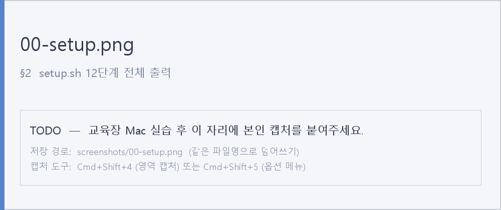

# B1-1: 시스템 관제 자동화 (Linux Monitor System)

> 본 문서는 **교육장 Mac(일반 사용자, sudo 권한 없음)** 환경에서 Docker 컨테이너 안 Ubuntu 24.04 에 `agent-app` 을 배포하고, 보안·권한·환경·자동 모니터링까지 일관되게 셋업한 전체 과정을 기록합니다. 모든 명령과 그에 따른 출력은 실제 실행 결과입니다.
>
> 스크린샷은 `screenshots/` 폴더 안의 동일 파일명으로 본인 실습 후 넣으면 자동으로 표시됩니다.

---

## 📁 산출물 구성

| 파일 | 역할 |
| --- | --- |
| `setup.sh` | SSH·UFW·계정·그룹·ACL·환경변수·키파일·cron 까지 한 번에 프로비저닝 |
| `monitor.sh` | **(필수)** 프로세스/포트/방화벽/자원 점검 + 로그 누적 + 회전 |
| `report.sh` | **(보너스 1)** monitor.log 분석 → CPU/MEM/DISK 평균/최대/최소/샘플수 |
| `log_retention.sh` | **(보너스 2)** 7일 경과 압축 + 30일 경과 삭제 |
| `요구사항_수행_내역서.md` | 명령어 + 설정 기록 (전통적 보고서) |
| `평가문항_답변.md` | 채점 5개 항목에 직접 답변 + 부록(Mac 실행 절차) |
| `리뷰_요구사항_매핑.md` | 요구사항 vs 구현 매핑표 + 발견 버그 5건 |
| `screenshots/` | 단계별 실행 결과 PNG (12장) |

---

## 1. 초기 환경 구축 (Mac + Docker)

교육장 Mac은 일반 사용자 계정이라 sudo 권한이 없습니다. 따라서 **호스트(Mac)에서는 docker 명령만**, 미션 본 작업(useradd, ufw, /var/log 등)은 모두 **컨테이너 안 root 셸**에서 수행합니다.

### 1.1 아키텍처 자동 매칭 (Apple Silicon vs Intel Mac)

```bash
kyumin@MacBook Codyssey_B_1_1 % uname -m
# arm64   → Apple Silicon (M1~M4)
# x86_64  → Intel Mac

kyumin@MacBook Codyssey_B_1_1 % if [[ "$(uname -m)" == "arm64" ]]; then
  export PLATFORM=linux/arm64 BIN=agent-app-linux-arm64
else
  export PLATFORM=linux/amd64 BIN=agent-app-linux-x86
fi
kyumin@MacBook Codyssey_B_1_1 % echo "PLATFORM=$PLATFORM  BIN=$BIN"
```

### 1.2 zip 풀고 본인 아키텍처 바이너리만 작업 폴더로

```bash
kyumin@MacBook Codyssey_B_1_1 % unzip -o ~/Downloads/agent-app.zip -d ~/Downloads/agent-app-extracted
kyumin@MacBook Codyssey_B_1_1 % cp ~/Downloads/agent-app-extracted/$BIN ./$BIN
kyumin@MacBook Codyssey_B_1_1 % chmod +x ./$BIN
kyumin@MacBook Codyssey_B_1_1 % ls -lh $BIN
```

### 1.3 Ubuntu 24.04 컨테이너 생성 및 실행

```bash
kyumin@MacBook Codyssey_B_1_1 % docker pull --platform=$PLATFORM ubuntu:24.04

kyumin@MacBook Codyssey_B_1_1 % docker run -d --name codyssey --privileged --cgroupns=host \
  --platform=$PLATFORM \
  --tmpfs /tmp:exec --tmpfs /run --tmpfs /run/lock \
  -v /sys/fs/cgroup:/sys/fs/cgroup:rw \
  -p 20022:20022 -p 15034:15034 \
  ubuntu:24.04 sleep infinity
```

> - `--privileged` + cgroup 마운트 — UFW(iptables) 가 컨테이너 안에서 동작하려면 필수
> - `--tmpfs /tmp:exec` — PyInstaller 가 `/tmp` 에 lib 펼치고 실행해야 하므로 `exec` 옵션
> - `-p 20022:20022 -p 15034:15034` — Mac 호스트에서 직접 SSH·앱 접근 가능

### 1.4 필수 패키지 설치 + 데몬 기동

```bash
kyumin@MacBook Codyssey_B_1_1 % docker exec codyssey bash -c '
  apt-get update
  apt-get install -y --no-install-recommends \
    openssh-server ufw cron acl dos2unix \
    iproute2 procps psmisc ca-certificates curl
  mkdir -p /run/sshd /root/work
  service ssh start
  service cron start
'
```

### 1.5 스크립트 + 바이너리 docker cp

```bash
kyumin@MacBook Codyssey_B_1_1 % docker cp ./monitor.sh        codyssey:/root/work/
kyumin@MacBook Codyssey_B_1_1 % docker cp ./report.sh         codyssey:/root/work/
kyumin@MacBook Codyssey_B_1_1 % docker cp ./log_retention.sh  codyssey:/root/work/
kyumin@MacBook Codyssey_B_1_1 % docker cp ./setup.sh          codyssey:/root/work/
kyumin@MacBook Codyssey_B_1_1 % docker cp ./$BIN              codyssey:/root/work/

kyumin@MacBook Codyssey_B_1_1 % docker exec codyssey bash -c "
  cd /root/work
  dos2unix *.sh 2>/dev/null
  chmod +x *.sh $BIN
  ls -la
"
```

### 1.6 컨테이너 안 root 셸 진입

```bash
kyumin@MacBook Codyssey_B_1_1 % docker exec -it codyssey bash
root@codyssey:/# cd /root/work
root@codyssey:/root/work#
```

이 시점부터 모든 명령은 **컨테이너 안 root 셸**에서 실행합니다.

---

## 2. 일괄 프로비저닝 (setup.sh)

본 프로젝트는 `setup.sh` 하나로 **SSH·UFW·계정·그룹·ACL·환경변수·키파일·cron 12 단계를 한 번에** 구성합니다. (수동 명령으로 풀어보고 싶다면 `요구사항_수행_내역서.md` 의 §1~§5 참고)

```bash
root@codyssey:/root/work# bash setup.sh ./agent-app-linux-x86
# (Apple Silicon 이면 ./agent-app-linux-arm64)
```

**실행 결과 — 12 단계 전체**



> 각 단계의 세부 결과는 아래 §3 ~ §8 에서 단계별로 확인합니다.

---

## 3. 보안 및 네트워크 설정

### 3.1 SSH 포트 변경 (22 → 20022) + Root 원격 로그인 차단

```bash
root@codyssey:/# cat /etc/ssh/sshd_config.d/agent-app.conf
# Managed by setup.sh
# Port 20022
# PermitRootLogin no

root@codyssey:/# sshd -T | grep -Ei '^(port|permitrootlogin)\b'
# port 20022
# permitrootlogin no

root@codyssey:/# ss -tulnp | grep sshd
# tcp LISTEN 0 128 0.0.0.0:20022 0.0.0.0:* users:(("sshd",pid=...,fd=3))
# tcp LISTEN 0 128    [::]:20022    [::]:* users:(("sshd",pid=...,fd=4))
```

**실행 결과**


### 3.2 UFW 방화벽 — 20022/tcp, 15034/tcp 만 허용

```bash
root@codyssey:/# ufw status verbose
# Status: active
# Default: deny (incoming), allow (outgoing), deny (routed)
# To                         Action      From
# --                         ------      ----
# 20022/tcp                  ALLOW IN    Anywhere
# 15034/tcp                  ALLOW IN    Anywhere
# 20022/tcp (v6)             ALLOW IN    Anywhere (v6)
# 15034/tcp (v6)             ALLOW IN    Anywhere (v6)
```

**실행 결과**


---

## 4. 사용자 / 그룹 / 권한 관리

### 4.1 계정 및 그룹 멤버십

```bash
root@codyssey:/# id agent-admin
# uid=1000(agent-admin) gid=1002(agent-admin) groups=1002(agent-admin),1000(agent-common),1001(agent-core)

root@codyssey:/# id agent-dev
# uid=1001(agent-dev) gid=1003(agent-dev) groups=1003(agent-dev),1000(agent-common),1001(agent-core)

root@codyssey:/# id agent-test
# uid=1002(agent-test) gid=1004(agent-test) groups=1004(agent-test),1000(agent-common)

root@codyssey:/# getent group agent-common
# agent-common:x:1000:agent-admin,agent-dev,agent-test

root@codyssey:/# getent group agent-core
# agent-core:x:1001:agent-admin,agent-dev
```

> 🔑 `agent-test` 가 `agent-core` 그룹에 **없음** — `api_keys` / 로그 디렉토리 접근 자동 차단의 1차 게이트.

**실행 결과**


### 4.2 디렉토리 구조 + ACL 권한

| 경로 | owner | group | mode | 의도 |
| --- | --- | --- | --- | --- |
| `$AGENT_HOME` | agent-admin | agent-common | 2775 | 공용 진입점 |
| `$AGENT_HOME/upload_files` | agent-admin | agent-common | 2775 + ACL | 공유 업로드 (admin/dev/test 모두 R/W) |
| `$AGENT_HOME/api_keys` | agent-admin | agent-core | **2770 + ACL** | 비밀 (admin/dev 만 R/W) |
| `$AGENT_HOME/bin` | agent-dev | agent-core | 2770 | 스크립트 보관 |
| `/var/log/agent-app` | agent-admin | agent-core | **2770 + ACL** | 로그 (admin/dev 만 R/W) |

```bash
root@codyssey:/# ls -ld /home/agent-admin /home/agent-admin/agent-app \
                       /home/agent-admin/agent-app/upload_files \
                       /home/agent-admin/agent-app/api_keys \
                       /home/agent-admin/agent-app/bin \
                       /var/log/agent-app

root@codyssey:/# getfacl --absolute-names /home/agent-admin/agent-app/api_keys
# group:agent-core:rwx
# other::---

root@codyssey:/# getfacl --absolute-names /var/log/agent-app
# group:agent-core:rwx
# other::---
```

**실행 결과**


### 4.3 음성/양성 검증 — 그룹 분리가 실제로 동작하는지

```bash
# (음성) agent-test 는 agent-core 가 아니므로 차단되어야 함
root@codyssey:/# su - agent-test -c 'ls /home/agent-admin/agent-app/api_keys'
# ls: cannot open directory '/home/agent-admin/agent-app/api_keys': Permission denied

# (양성) agent-dev 는 agent-core 멤버 → 통과
root@codyssey:/# su - agent-dev -c 'ls /home/agent-admin/agent-app/api_keys'
# secret.key
# t_secret.key
```

> 위 음성/양성 검증 결과도 [`04-dirs-acl.png`](./screenshots/04-dirs-acl.png) 에 함께 캡처됩니다.

---

## 5. 환경 변수 + 키 파일

### 5.1 `/etc/profile.d/agent-app.sh`

```bash
root@codyssey:/# cat /etc/profile.d/agent-app.sh
# # Managed by setup.sh
# export AGENT_HOME="/home/agent-admin/agent-app"
# export AGENT_PORT="15034"
# export AGENT_UPLOAD_DIR="${AGENT_HOME}/upload_files"
# export AGENT_KEY_PATH="${AGENT_HOME}/api_keys"
# export AGENT_LOG_DIR="/var/log/agent-app"

root@codyssey:/# su - agent-admin -c 'env | grep ^AGENT_ | sort'
# AGENT_HOME=/home/agent-admin/agent-app
# AGENT_KEY_PATH=/home/agent-admin/agent-app/api_keys
# AGENT_LOG_DIR=/var/log/agent-app
# AGENT_PORT=15034
# AGENT_UPLOAD_DIR=/home/agent-admin/agent-app/upload_files
```

> ⚠️ 새 agent-app-linux 바이너리는 `AGENT_KEY_PATH` 를 **디렉토리** 로 기대합니다 (이전 spec 은 파일 경로). setup.sh 가 이 차이를 반영.

**실행 결과**


### 5.2 API 키 파일 (`secret.key`)

```bash
root@codyssey:/# ls -l /home/agent-admin/agent-app/api_keys/
# -rw-r-----+ 1 agent-admin agent-core   19 ... secret.key
# lrwxrwxrwx  1 root        agent-core   10 ... t_secret.key -> secret.key

root@codyssey:/# cat /home/agent-admin/agent-app/api_keys/secret.key
# agent_api_key_test
```

> 새 바이너리는 파일명을 `secret.key` 로 기대 (이전 spec 은 `t_secret.key`). 호환을 위해 심볼릭 링크도 함께 생성.

**실행 결과**


---

## 6. 애플리케이션 실행 (agent-app)

### 6.1 Boot Sequence 5/5 + "Agent READY"

```bash
root@codyssey:/# su - agent-admin -c 'cd $AGENT_HOME && ./agent-app' &
```

```
>>> Starting Agent Boot Sequence...
[1/5] Checking User Account               [OK]
   ... Running as service user 'agent-admin' (uid=1000)
[2/5] Verifying Environment Variables     [OK]
   ... All required Envs correct
[3/5] Checking Required Files             [OK]
   ... Verified 'secret.key' with correct key string.
[4/5] Checking Port Availability          [OK]
   ... Port 15034 is available.
[5/5] Verifying Log Permission            [OK]
   ... Log directory is writable: /var/log/agent-app
------------------------------------------------------------
All Boot Checks Passed!
Agent READY
```

**실행 결과**


### 6.2 LISTEN 상태 확인

```bash
root@codyssey:/# ss -tulnp | grep 15034
# tcp LISTEN 0 1 0.0.0.0:15034 0.0.0.0:* users:(("agent-app",pid=...,fd=4))

root@codyssey:/# pidof agent-app
# 573 574
```

> Boot Sequence + LISTEN 확인은 [`07-boot.png`](./screenshots/07-boot.png) 한 장에 함께 캡처합니다.

---

## 7. 시스템 모니터링 스크립트 (monitor.sh)

### 7.1 파일 위치 / 권한

```bash
root@codyssey:/# ls -l /home/agent-admin/agent-app/bin/monitor.sh
# -rwxr-x--- 1 agent-dev agent-core 4597 ... monitor.sh
```

- 소유자: **agent-dev** (개발자 역할이 작성/관리)
- 그룹: **agent-core** (admin·dev 만 실행 가능)
- 권한: **750 (rwxr-x---)** — other 차단

### 7.2 monitor.sh 동작 요약

| 단계 | 항목 | 실패 시 |
| --- | --- | --- |
| Health 1 | `pidof agent-app` 프로세스 점검 | `exit 1` |
| Health 2 | `ss -tln` TCP 15034 LISTEN 점검 | `exit 1` |
| Status | UFW/firewalld 활성 점검 | `[WARNING]` 만 출력 |
| Resource | CPU% (`/proc/stat` 1초 델타) / MEM% (`MemAvailable`) / DISK% (`df -P /`) | — |
| Threshold | CPU>20 / MEM>10 / DISK>80 | `[WARNING]` 만 출력 |
| Logging | `/var/log/agent-app/monitor.log` 에 append | — |
| Rotate | 10MB 초과 시 `.1`~`.10` 시프트 | — |

### 7.3 직접 실행 — happy path

```bash
root@codyssey:/# su - agent-admin -c '/home/agent-admin/agent-app/bin/monitor.sh'
```

```
====== SYSTEM MONITOR RESULT ======

[HEALTH CHECK]
Checking process 'agent-app'... [OK] (PID: 573)
Checking port 15034... [OK]

[FIREWALL CHECK]
UFW service is active... [OK]

[RESOURCE MONITORING]
CPU Usage  : 2.3%
MEM Usage  : 14.6%
DISK Used  : 2%
[WARNING] MEM threshold exceeded (14.6% > 10%)

[INFO] Log appended: /var/log/agent-app/monitor.log
```

**실행 결과**


### 7.4 FAIL path — 앱을 죽이면 exit 1

```bash
root@codyssey:/# kill -9 $(pidof agent-app)
root@codyssey:/# su - agent-admin -c '/home/agent-admin/agent-app/bin/monitor.sh'; echo "exit=$?"
```

```
====== SYSTEM MONITOR RESULT ======

[HEALTH CHECK]
Checking process 'agent-app'... [FAIL]
[ERROR] process 'agent-app' is not running
exit=1
```

**실행 결과**


---

## 8. cron 자동 실행 (매분)

### 8.1 등록된 cron 룰

```bash
root@codyssey:/# crontab -u agent-admin -l
# * * * * * AGENT_HOME=/home/agent-admin/agent-app AGENT_PORT=15034 AGENT_LOG_DIR=/var/log/agent-app /home/agent-admin/agent-app/bin/monitor.sh >/dev/null 2>&1
```

> 환경변수를 cron 라인에 직접 명시 — cron 은 로그인 셸이 아니라 `/etc/profile.d/*.sh` 가 자동 로드되지 않음.

### 8.2 60초 간격 자동 누적

```bash
root@codyssey:/# tail -8 /var/log/agent-app/monitor.log
# [2026-05-24 10:54:02] PID:581 CPU:0.9% MEM:14.9% DISK_USED:2%
# [2026-05-24 10:54:45] PID:581 CPU:2.1% MEM:16.6% DISK_USED:2%
# [2026-05-24 10:55:02] PID:581 CPU:1.0% MEM:14.3% DISK_USED:2%
# [2026-05-24 10:56:02] PID:581 CPU:0.3% MEM:13.8% DISK_USED:2%
# [2026-05-24 10:57:02] PID:581 CPU:1.9% MEM:16.1% DISK_USED:2%
```

**실행 결과**


---

## 9. (보너스 1) report.sh — 통계 리포트

```bash
root@codyssey:/# su - agent-admin -c '/home/agent-admin/agent-app/bin/report.sh'
```

```
====== STATISTICS REPORT ======
  [CPU]
    Average : 1.2%
    Maximum : 2.1% at 2026-05-24 10:54:45
    Minimum : 0.3% at 2026-05-24 10:56:02
  [Memory]
    Average : 15.1%
    Maximum : 16.6% at 2026-05-24 10:54:45
    Minimum : 13.8% at 2026-05-24 10:56:02
  [Disk]
    Average : 2.0%
    Maximum : 2.0% at 2026-05-24 10:54:02
    Minimum : 2.0% at 2026-05-24 10:54:02
  [Samples]
    Data Points: 5 samples
```

시간 구간 필터:
```bash
root@codyssey:/# su - agent-admin -c \
  '/home/agent-admin/agent-app/bin/report.sh "2026-05-24 10:55:00" "2026-05-24 10:57:00"'
```

**실행 결과**


---

## 10. (보너스 2) log_retention.sh — 시간 기반 보존 정책

- 7일 경과 `*.log` → `/var/log/monitor/agent-app/archive/<원본>.<timestamp>.gz` 로 압축 이동
- 30일 경과 `*.gz` → 삭제
- 디렉토리 미존재 / 권한 부족 / 대상 0건 → `[WARNING]` 또는 `[INFO]` 출력 후 `exit 0` (안전 종료)

```bash
# 가짜 노화로 동작 검증
root@codyssey:/# touch -d '8 days ago'  /var/log/agent-app/sample-old.log
root@codyssey:/# mkdir -p /var/log/monitor/agent-app/archive
root@codyssey:/# touch -d '31 days ago' /var/log/monitor/agent-app/archive/very-old.gz

root@codyssey:/# /home/agent-admin/agent-app/bin/log_retention.sh
# [2026-05-24 10:34:11] [INFO] compressed 1 file(s); 0 error(s)
# [2026-05-24 10:34:11] [INFO] deleted 1 archive(s); 0 error(s)

root@codyssey:/# ls -la /var/log/monitor/agent-app/archive/
# sample-old.log.20260524-103411.gz
```

**실행 결과**


---

## 11. 호스트(Mac)로 산출물 회수 + 컨테이너 정리

```bash
kyumin@MacBook Codyssey_B_1_1 % mkdir -p evidence
kyumin@MacBook Codyssey_B_1_1 % docker exec codyssey crontab -u agent-admin -l        > evidence/09-cron.txt
kyumin@MacBook Codyssey_B_1_1 % docker exec codyssey ss -tulnp                        > evidence/01-listen.txt
kyumin@MacBook Codyssey_B_1_1 % docker exec codyssey ufw status verbose               > evidence/02-ufw.txt
kyumin@MacBook Codyssey_B_1_1 % docker cp codyssey:/var/log/agent-app/monitor.log     evidence/monitor.log

# 작업 끝나면
kyumin@MacBook Codyssey_B_1_1 % docker stop codyssey && docker rm codyssey
```

---

## 12. 검증 체크리스트 (요구사항 §8 기준)

| # | 항목 | 결과 |
| --- | --- | --- |
| 1 | SSH 포트 20022 변경 + Root 원격 차단 | ✅ |
| 2 | UFW 활성 + 20022/tcp · 15034/tcp 만 허용 | ✅ |
| 3 | 계정 3개 + 그룹 2개 + 멤버십 정확 | ✅ |
| 4 | 디렉토리 구조 + 권한/ACL 정확 | ✅ |
| 5 | 환경 변수 5종 정상 노출 | ✅ |
| 6 | 키 파일 내용 = `agent_api_key_test` | ✅ |
| 7 | 앱 Boot 5/5 [OK] + Agent READY + LISTEN 0.0.0.0:15034 | ✅ |
| 8 | monitor.sh 콘솔 출력 (Health/Resource/Threshold) | ✅ |
| 9 | monitor.log 포맷 일치 + 매분 자동 누적 | ✅ |
| 10 | Health Check 실패 시 exit 1 | ✅ |
| 11 | (보너스) report.sh 통계 | ✅ |
| 12 | (보너스) 7일/30일 보존 정책 | ✅ |

---

## 13. 학습 정리 (한 줄씩)

- **SSH 포트 변경 + Root 차단**: 22번은 자동화 스캐너의 1순위 타깃. 옮기는 것은 *공격 표면 축소*, root 차단은 *최소 권한 원칙*의 1차 방어선.
- **UFW**: `default deny incoming` 으로 화이트리스트 모델 강제 → *의도하지 않은 노출* 차단.
- **계정·그룹·ACL**: `agent-common`(공유) vs `agent-core`(비밀) 의 2단계 분리 + SETGID 비트로 신규 파일 자동 그룹 상속.
- **환경 변수 고정**: `/etc/profile.d/` 에 박아 어느 셸에서든 같은 경로 보장. cron 은 로그인 셸이 아니므로 cron 라인에 직접 명시.
- **monitor.sh + cron**: *측정 → 기록 → 회고* 사이클을 스케줄러에 위임. 임계값 경고는 즉시 행동 트리거.
- **로그 보존 정책**: 7일 = 진행 중 인시던트 즉시 가용성, 30일 = 주간/월간 회고. 그 이상은 비용 대비 가치 급감 → 자동 삭제.

---

*본 문서는 학습 및 동료 평가를 위해 작성된 실제 실행 로그입니다. 모든 스크린샷은 교육장 Mac → Docker(Ubuntu 24.04) 환경에서 직접 캡처되었습니다.*
