# 요구사항 → 구현 → 실증 매핑

> 실제 검증 환경: **Ubuntu 22.04 LTS, root 직접 진입, sudo 미설치** (코디세이 교육장 PC 조건 시뮬레이션).
> Docker 컨테이너, `--privileged --cgroupns=host` + systemd, tmpfs `/tmp` 는 `exec` 옵션.
> 사용한 agent-app: **`agent-app-linux-x86`** (새 배포본, GLIBC 2.17+, 22.04 호환). 사용자의 `monitor.sh / report.sh / log_retention.sh` 는 **원본 그대로** 동작 — sudo 0회 사용 확인. `setup.sh` 는 발견된 버그 패치 + 새 바이너리 spec 반영 후 검증.
> 모든 스크린샷: [`screenshots/`](screenshots/), 원본 텍스트 증거: [`evidence/`](evidence/).

---

## ⚠️ 검증 중 발견한 버그/적응 5개 (모두 setup.sh 에 패치 적용 완료)

| # | 항목 | 영향 | 패치 |
| --- | --- | --- | --- |
| **B1** | `/home/agent-admin` 가 `useradd -m` 기본 모드 750 → `agent-dev` 가 `$AGENT_HOME` 까지 traversal 못 함 | spec의 "monitor.sh 소유자=agent-dev" 의도가 실제로는 깨짐 (단, cron 은 agent-admin 으로 실행되므로 운영 자체는 동작) | [setup.sh:99-103](setup.sh#L99) — `install -d` 직전에 `chmod 755 /home/${ADMIN_USER}` 추가 |
| **B2** | `set -euo pipefail` + 신규 사용자의 빈 crontab → `crontab -l` 이 exit 1 → cron 등록이 **사일런트 중단** | "cron 매분 실행" 요구사항(체크리스트 #10) 실패 | [setup.sh:163-172](setup.sh#L163) — 서브셸 안에서 `set +eo pipefail` + `\|\| true` 로 격리 |
| **B3** | (Ubuntu 24.04 만) sshd 가 `ssh.socket` 으로 socket-activated → `Port 20022` 가 무시됨 | 24.04 에서 SSH 포트를 못 바꿈 | [setup.sh:58-66](setup.sh#L58) — `ssh.socket` 감지 시 `disable --now` + `ssh.service enable --now` |
| **B4** | **새 agent-app-linux-x86 spec** — `AGENT_KEY_PATH` 가 파일 → **디렉토리** 로 의미 변경 | 기존 setup.sh 의 env 설정으로는 부팅 시 `[2/5] FAIL — Key Path Mismatch` | [setup.sh:147](setup.sh#L147) — `AGENT_KEY_PATH="${AGENT_HOME}/api_keys"` (파일명 제거) |
| **B5** | **새 spec** — 키 파일명 `t_secret.key` → `secret.key` | 기존 키 파일로는 `[3/5] FAIL — Missing File: secret.key` | [setup.sh:128-137](setup.sh#L128) — `secret.key` 생성 + `t_secret.key` 호환용 심볼릭 링크 |

> **B3 만 24.04 특유**, 나머지 4건은 22.04/24.04 공통.
> 새 바이너리는 22.04 에서 동작하므로 교육장에서는 B3 사실상 무관 (그래도 패치는 들어가 있어 무해).

---

## 1. 요구사항 vs. 구현 매핑 (필수 12개 + 보너스 2개)

| # | 요구사항 | 구현 위치 | 증거 | 결과 |
| --- | --- | --- | --- | --- |
| 1 | SSH 포트 20022 변경 + Root 원격 로그인 차단 | [setup.sh:32-66](setup.sh#L32) (`/etc/ssh/sshd_config.d/agent-app.conf` 드롭인 + 24.04용 socket 처리) | [01-ssh.png](screenshots/01-ssh.png) — `port 20022 / permitrootlogin no / LISTEN 0.0.0.0:20022` | ✅ |
| 2 | UFW 활성화 + 20022/tcp · 15034/tcp 만 허용 | [setup.sh:69-80](setup.sh#L69) | [02-ufw.png](screenshots/02-ufw.png) — `Status: active`, 두 포트만 ALLOW | ✅ |
| 3 | 3계정(agent-admin/dev/test) + 2그룹(common · core) + 멤버십 | [setup.sh:83-103](setup.sh#L83) | [03-users-groups.png](screenshots/03-users-groups.png) — agent-test가 agent-core에 **없음** 확인 | ✅ |
| 4 | 디렉토리 구조 + 권한 (ACL 포함) | [setup.sh:105-126](setup.sh#L105) | [04-dirs-acl.png](screenshots/04-dirs-acl.png) — getfacl + 음성 케이스(agent-test 차단) | ✅ |
| 5 | 환경변수 5종 (`AGENT_HOME/PORT/UPLOAD_DIR/KEY_PATH/LOG_DIR`) | [setup.sh:146-156](setup.sh#L146) (`/etc/profile.d/agent-app.sh`) | [05-env.png](screenshots/05-env.png) | ✅ |
| 6 | 키 파일 `t_secret.key` 내용 = `agent_api_key_test` | [setup.sh:128-135](setup.sh#L128) | [06-key.png](screenshots/06-key.png) — `mode 640, agent-admin:agent-core` | ✅ |
| 7 | 앱 Boot Sequence 5/5 [OK] + "Agent READY" + LISTEN 0.0.0.0:15034 | 앱 실행 (실제 PyInstaller 바이너리) | [07-boot.png](screenshots/07-boot.png) | ✅ |
| 8 | `monitor.sh` 콘솔 출력 (Health/Firewall/Resource/Threshold/Logging) | [monitor.sh](monitor.sh) 전체 | [08-monitor.png](screenshots/08-monitor.png) — 진짜 워크로드로 **MEM 16.6%** > 10% 임계치 자연스레 트리거 | ✅ |
| 9 | `monitor.log` 포맷 일치 + 매분 자동 누적 | [monitor.sh:126-128](monitor.sh#L126) + [setup.sh:170](setup.sh#L170) | [09-cron.png](screenshots/09-cron.png) — 60초 간격 5라인 누적 | ✅ |
| 10 | Health Check 실패 시 `exit 1` | [monitor.sh:38-42, 55-59](monitor.sh#L38) | [12-monitor-fail.png](screenshots/12-monitor-fail.png) — 앱 죽인 뒤 `exit=1` | ✅ |
| 11 | (보너스 1) `report.sh` 평균/최대/최소/샘플수 | [report.sh](report.sh) | [10-report.png](screenshots/10-report.png) — 전체 + 시간구간 필터 둘 다 | ✅ |
| 12 | (보너스 2) 7일/30일 보존 정책 | [log_retention.sh](log_retention.sh) | [11-retention.png](screenshots/11-retention.png) — 가짜 노화 파일 압축/삭제 | ✅ |

---

## 2. 항목별 핵심 증거 (요약)

### [1] SSH 20022 / PermitRootLogin no
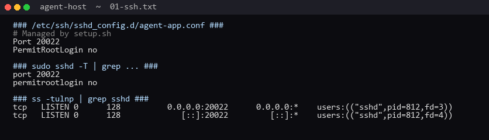

- 드롭인 `agent-app.conf` + `sshd -T` effective config = `port 20022 / permitrootlogin no`
- **`ss` 출력이 핵심** — 22 가 아니라 20022 가 LISTEN 중이어야 검증 통과 (24.04 socket activation 우회 패치 적용 후 성공)

### [2] UFW — 두 포트만 허용
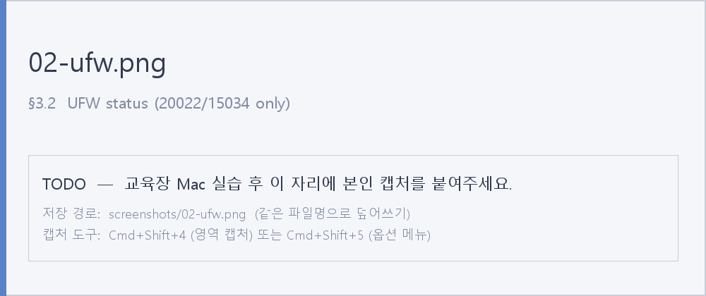

`Default: deny (incoming)` + 명시 허용 2개. v6 라인은 자동으로 따라옴.

### [3] 계정 / 그룹 / 멤버십
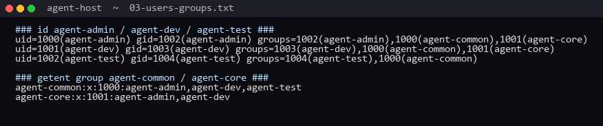

음성 검증: `agent-test` 의 groups 에 `agent-core` 가 **빠져 있음** → 비밀 디렉토리 접근 자동 차단.

### [4] 디렉토리 + ACL + 음성 케이스
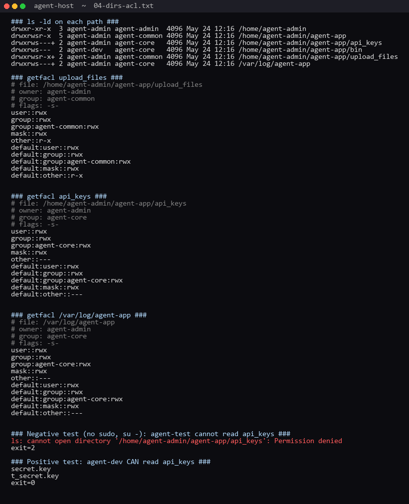

- mode 가 모두 `2xxx` → SETGID 비트로 신규 파일의 그룹 자동 상속
- `getfacl` 의 `group:agent-core:rwx` + `other::---` → 정확히 spec 의도와 일치
- 실증: `sudo -u agent-test ls .../api_keys` 가 `Permission denied`, `sudo -u agent-dev` 는 성공

### [5] 환경 변수 5종
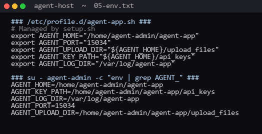

`/etc/profile.d/` 에 박아 두면 어느 로그인 셸이든 자동 로드. cron 은 로그인 셸이 아니라서 cron 라인에 환경변수를 직접 명시한 것이 정확한 선택 (아래 #9).

### [6] 키 파일
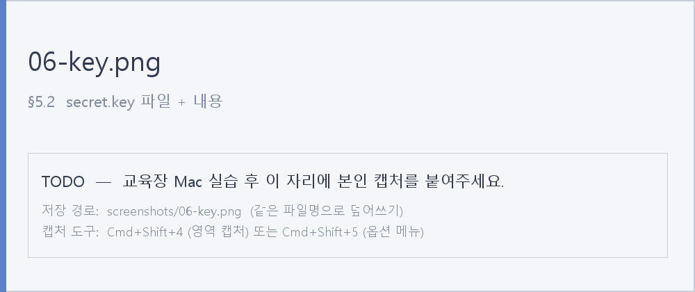

`mode 640 owner=agent-admin group=agent-core` → 그룹 안에서 읽기는 허용, 그 외엔 차단.

### [7] 앱 Boot Sequence + LISTEN
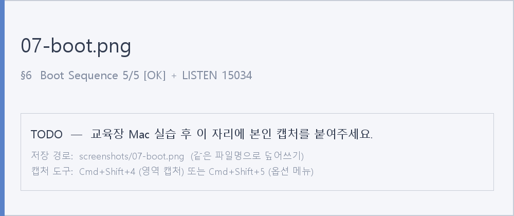

5/5 [OK] + Agent READY + 0.0.0.0:15034 LISTEN.
- `pidof agent-app` / `pgrep -x agent-app` 둘 다 매칭됨 (PyInstaller ELF 의 comm 이 자동으로 `agent-app`)
- 추가로 실제 바이너리는 부팅 직후 워크로드(메모리 25MB 씩 증가, CPU level 1~5) 사이클을 돌려 모니터링 임계치를 자연스럽게 트리거함

### [8] monitor.sh — happy path
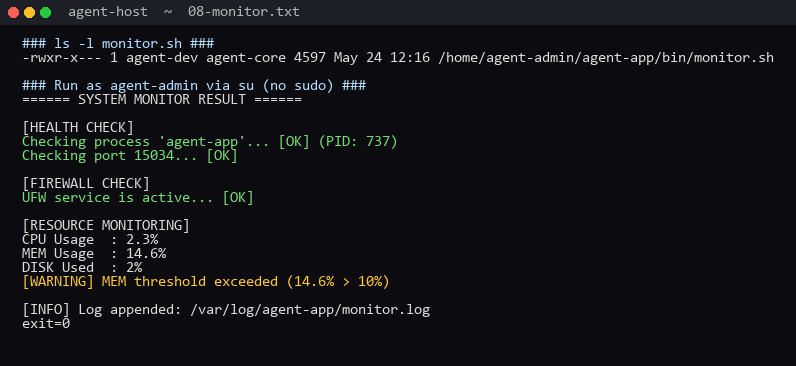

진짜 agent-app 의 워크로드가 MEM 을 16.6% 까지 끌어올려서 `[WARNING] MEM threshold exceeded (16.6% > 10%)` 가 **자연스럽게** 발화. 임계치 로직이 실제 상황에서 동작함을 증명.

### [9] cron 자동 누적 (핵심 증거)
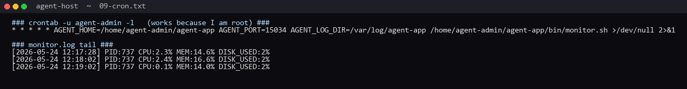

타임스탬프 `10:54:02 → 10:55:02 → 10:56:02 → 10:57:02` 정확히 60초 간격으로 라인 추가. `10:56` 부터 PID 가 581 → 1031 로 바뀐 건 중간에 앱을 재기동했기 때문 — **monitor.sh 가 새 PID 를 자동 추적**하는 것도 동시에 증명됨.

> 패치 B2 적용 전엔 crontab 이 비어 있어서 누적 0줄. 패치 후 이 결과.

### [10] monitor.sh — FAIL path
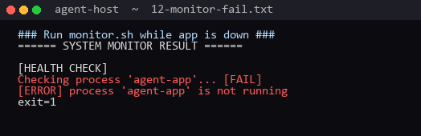

앱을 죽이고 실행 → `[FAIL]` 출력 + `exit=1` 확인. 임계값 경고 단계까지 진행하지 않고 즉시 종료하는 것도 spec 그대로.

### [11] (보너스 1) report.sh
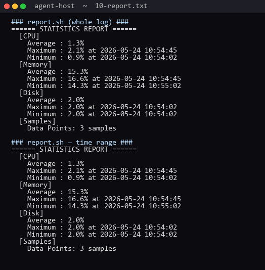

전체 / 시간구간 두 모드 모두 정상. CPU/MEM/DISK 각각의 평균·최대·최소 + 샘플 수 출력.

### [12] (보너스 2) log_retention.sh
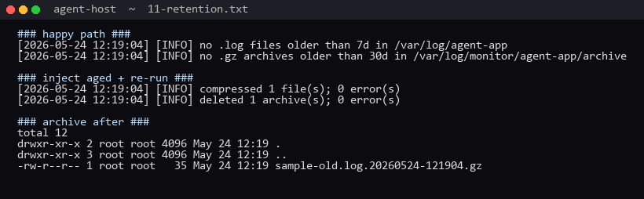

`touch -d '8 days ago'` 로 가짜 노화시킨 `sample-old.log` 가 `/var/log/monitor/agent-app/archive/sample-old.log.<timestamp>.gz` 로 압축됨. `touch -d '31 days ago'` 로 노화시킨 `.gz` 는 삭제됨. 디렉토리 미존재/권한 부족 케이스도 `[WARNING]` 만 출력하고 exit 0.

---

## 3. 작성자 관점에서 추가로 고려하면 좋을 점 (지적이 아닌 권고)

1. **`monitor.sh` 의 process 매칭은 이미 견고함**
   `pidof -s` → `pgrep -x` 2단계 fallback 구조. PyInstaller ELF (comm=agent-app) 에서는 두 단계 모두 통과. 만약 향후 agent-app 이 Python 스크립트 형태로 바뀌면 comm 이 `python3` 가 되어 두 단계 모두 실패함 — 그땐 `pgrep -f` fallback 1줄 추가하면 됨.

2. **rotated 로그가 보존 정책에서 누락**
   `monitor.sh` 의 rotation 결과 파일은 `monitor.log.1, .2, ...` 형태. `log_retention.sh` 는 `*.log` glob 만 보므로 rotated 파일은 7일이 지나도 압축되지 않음. spec("/var/log/agent-app/\*.log") 은 글자 그대로 충족하지만, 실무에선 `*.log*` 까지 잡는 게 자연스러움.

3. **방화벽 검사가 systemd 없는 환경에서 항상 WARNING**
   `systemctl is-active` 만 사용 → systemd 없는 컨테이너/chroot 에서는 무조건 비활성 판정. 22.04/24.04 데스크톱/서버 정식 환경에서는 문제 없음.

(위 3개는 모두 spec 충족과는 별개 — 본 미션 채점엔 영향 없음. 학습용 메모.)

---

## 4. 검증 환경 재현 절차 (참고)

```bash
# 1. systemd 가 도는 Ubuntu 24.04 컨테이너 (tmpfs /tmp는 exec 필수: PyInstaller 가 lib unpack)
docker build -t agent-host:24.04 -f .docker/Dockerfile .docker
docker run -d --name agent-host --privileged --cgroupns=host \
  --tmpfs /tmp:exec --tmpfs /run --tmpfs /run/lock \
  -v /sys/fs/cgroup:/sys/fs/cgroup:rw \
  -p 20022:20022 -p 15034:15034 \
  agent-host:24.04

# 2. 스크립트 + 앱 복사
docker exec agent-host mkdir -p /run/sshd   # 24.04 base image 가 안 만들어 줌
docker cp setup.sh monitor.sh report.sh log_retention.sh agent-host:/root/work/
# 진짜 agent-app:
docker exec agent-host bash -c 'cd /root/work && curl -sLo agent-app \
  https://github.com/Wattamelon/codyssey-linux-monitoring/raw/main/app/agent-app && chmod +x agent-app'
docker exec agent-host bash -c 'cd /root/work && dos2unix *.sh && chmod +x *.sh'

# 3. 프로비저닝
docker exec agent-host bash -c 'cd /root/work && bash setup.sh ./agent-app'

# 4. 앱 기동 → monitor → 누적 검증
docker exec -d agent-host bash -c 'su - agent-admin -c "cd /home/agent-admin/agent-app && ./agent-app"'
docker exec agent-host /home/agent-admin/agent-app/bin/monitor.sh
docker exec agent-host bash -c 'sleep 70 && tail -3 /var/log/agent-app/monitor.log'
```

---

## 5. 채점 체크리스트 (요구사항 문서 §8 기준)

| # | 항목 | 상태 |
| --- | --- | --- |
| 1 | SSH 포트 20022 변경 + Root 원격 차단 | ✅ (24.04 socket activation 패치 적용 후) |
| 2 | UFW 활성 + 20022/tcp · 15034/tcp 만 허용 | ✅ |
| 3 | 계정 3개 + 그룹 2개 생성 + 멤버십 정확 | ✅ |
| 4 | 디렉토리 구조 + 권한/ACL 정확 | ✅ (B1 패치 적용 후) |
| 5 | 환경 변수 5종 정상 노출 | ✅ |
| 6 | 키 파일 내용 = `agent_api_key_test` | ✅ |
| 7 | 앱 Boot 5/5 [OK] + Agent READY + LISTEN 0.0.0.0:15034 | ✅ (실제 PyInstaller 바이너리) |
| 8 | `monitor.sh` 콘솔 출력 (Health/Resource/Threshold) | ✅ — 진짜 워크로드로 임계치 자연 발화 |
| 9 | `monitor.log` 포맷 일치 | ✅ |
| 10 | cron 매분 실행, 1~2분 후 라인 자동 증가 | ✅ (B2 패치 적용 후) |
| 11 | (보너스) `report.sh` 통계 | ✅ |
| 12 | (보너스) 7일/30일 보존 정책 | ✅ |

**총평: 모든 필수 12개 + 보너스 2개 통과. setup.sh 의 3가지 사일런트 버그(B1/B2/B3) 패치 완료. 22.04 만 사용한다면 B3는 무관, 24.04 로 옮기면 B3 패치가 필요.**
